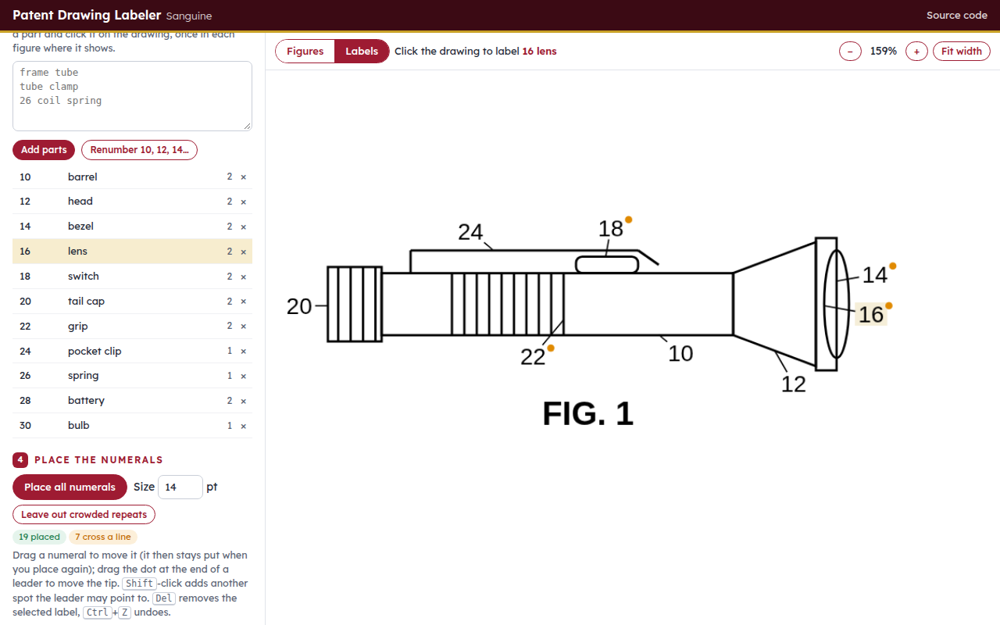

# Patent Drawing Labeler (Sanguine)

*Why Sanguine? The red chalk that Leonardo and Michelangelo drew with.*

**Runs on** any web browser: nothing to install, and the drawing never leaves your computer.

**Version 1.0.**

Part of [Veered](https://veered.org): free tools, shared as-is. Questions: support@veered.org

**Use it now: [veered.org/patent-drawing-labeler/app/](https://veered.org/patent-drawing-labeler/app/)**
(also at [patentlawny.com/patent-tools/label/](https://patentlawny.com/patent-tools/label/)).

Open a patent drawing, list the parts, and click each part once on the drawing. The
labeler puts the reference numeral in clear paper beside the figure and draws the
leader line. It picks a spot where the line is short, crosses as little of the
drawing as possible, and doesn't run into another numeral or leader. You get a
labeled PDF, an editable PowerPoint, and the reference numeral list for the
specification.

You don't have to do the clicking yourself. Claude can look at the drawing, name
and number the parts, and say where each one is. You paste its answer in, and the
labels are placed the same way.

*The sample drawing. Claude chose these numerals and points; the labeler placed them.
The small orange dots mark leaders that had to cross one line of the drawing.*

> **A drafting aid, not a draftsman.** Check every leader against the part it names
> before you file. Also check the drawings against 37 CFR 1.84 as it stands when you
> file. Nothing is sent to the Patent Office or anywhere else.

## What it does

- **Finds the figures.** It separates each view on a sheet. You can join, split or
  redraw them by dragging boxes. You can keep the sheets as drawn, or put each
  figure on its own Letter or A4 sheet, enlarged to fill it, with sheet numbers
  ("1/7").
- **Places the numerals.** For each part you click, it tries hundreds of positions
  and picks the best one. The best spot is clear of the drawing, inside the 37 CFR
  1.84(g) margins, close to the part, and outside the figure's outline, with a
  leader that crosses as few lines as it can and runs near no other part's tip.
  Then it shuffles the hardest labels until all of them fit together.
- **Lets you fix anything.** You can drag a numeral, or drag the tip of its leader.
  A numeral you move stays where you put it the next time you place everything.
  <kbd>Shift</kbd>-click marks other spots on the same part that the leader may
  point to (a spring can be pointed at on any coil). **Leave out crowded repeats**
  drops a numeral from a figure where its leader would cross two or more lines,
  when another figure already shows it cleanly.
- **Keeps the numbering straight.** You type the parts with or without numerals.
  **Renumber** assigns 10, 12, 14… in list order and updates every label.
  Suffixes like 26a and 26b tell identical parts apart.
- **Writes the files:**
  - a **labeled PDF**. The original drawing stays vector, and the font is embedded
    (Patent Center rejects fonts that aren't embedded).
  - an **editable PowerPoint**. The drawing is a picture, and each numeral and
    leader is its own text box or line.
  - the **reference numeral list**: a Word table with Numeral, Element and "Shown
    in" (FIGS. 1–3 and 5) columns, plus plain-text and CSV copies.
  - a **project file**, so you can come back to the same labels later.

## How you use it

1. **Open the drawing:** a PDF, or a PNG or JPEG scan.
2. **Check the figures** in the *Figures* view. Choose whether to keep the sheets
   as drawn or give each figure its own sheet.
3. **List the parts**, one per line, and press *Add parts*.
4. **Pick a part** in the list, then **click it on the drawing**: once in each
   figure where it shows, on a line of the part. The numeral appears at once.
5. Press **Place all numerals** to re-place everything together. Then fix
   anything you don't like by dragging it.
6. **Download** the PDF, the PowerPoint and the parts list.

### Letting Claude do the clicking

1. Press **Page images with grid**. It saves each sheet as a picture with a
   percent grid, so Claude can read positions off it.
2. Press **Copy the prompt**. The prompt already lists the figures found and any
   parts you have typed.
3. In [Claude](https://claude.ai) (free accounts work), attach the images, paste
   the prompt and send it.
4. Copy Claude's whole reply, press **Paste Claude's answer**, and import it.
   Each point is snapped to the nearest line and the labels are placed.
5. **Check every leader.** Claude reads positions off a picture and will sometimes
   pick the wrong line. Drag the tip to fix it.

The sample drawing (*Try it on a sample drawing*) shows the whole round trip:
[examples/flashlight-claude.json](examples/flashlight-claude.json) is the answer
Claude gave for [examples/flashlight.pdf](examples/flashlight.pdf).

## Information for nerds

It is one static page (`index.html`, `app.js`, `engine.js`, `fonts/`) with no build
step and no server. Serve the folder with any web server, for example
`python3 -m http.server`, and open it. It loads pdf.js, pdf-lib, fontkit and JSZip
from cdnjs/jsDelivr, and PptxGenJS only when you ask for a PowerPoint.

**The placement engine** (`engine.js`, no dependencies, runs in the browser and in
Node) works on the sheet rendered at 144 dpi:

- a dilated ink mask, so it can tell whether a leader touches a line;
- summed-area tables, for a constant-time "is this box clear?" test;
- the figure's filled silhouette, so numerals prefer the outside.

For each tip it scores numeral positions at 10° steps and a range of distances:
`600 × lines crossed + 4 × ink under the leader + 0.25 × length + an outward-direction
term + 2500 if inside the outline`. It then places the labels greedily, hardest
first (the ones with the fewest cheap spots). The unplaced labels move to the front
and it tries again, and five repair passes re-pick each label against all the
others. Candidates are rejected when numerals come within 16 px of each other,
when leaders cross or pass within 20 px, or when a leader clips a numeral. The
constants were tuned at 200 dpi and scale with the render.

Coordinates in Claude's answer are percent of the sheet as shown (fractions are
accepted too). Label points are snapped to the nearest ink within about 12 pt, and
a figure box that roughly matches one already found keeps the tighter box.

**Tests:** `node tests/engine.test.js` builds a synthetic drawing and checks that
the numerals land on clear paper inside the margins, that no two collide, that the
leaders don't cross, and that the figure finder separates the drawings.

`examples/make_flashlight.py` redraws the sample drawing (needs `reportlab`).

The label font is Liberation Sans (SIL Open Font License 1.1, see
`fonts/LICENSE-LiberationSans.txt`). It has Helvetica's metrics and can be embedded.

## License

MIT. See [LICENSE](LICENSE). The bundled Liberation Sans font is under the SIL Open
Font License 1.1. Written with AI assistance (Claude).
